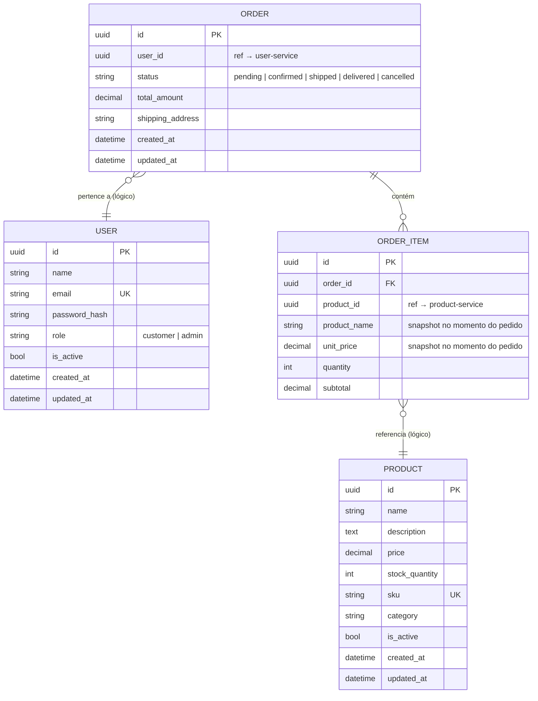
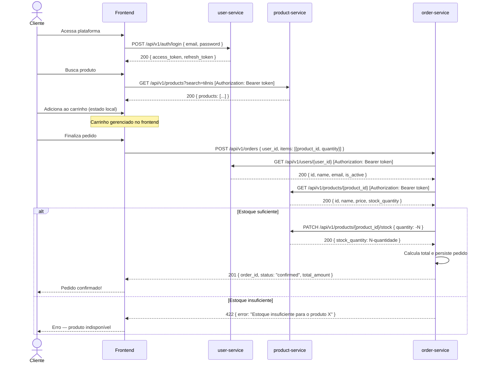
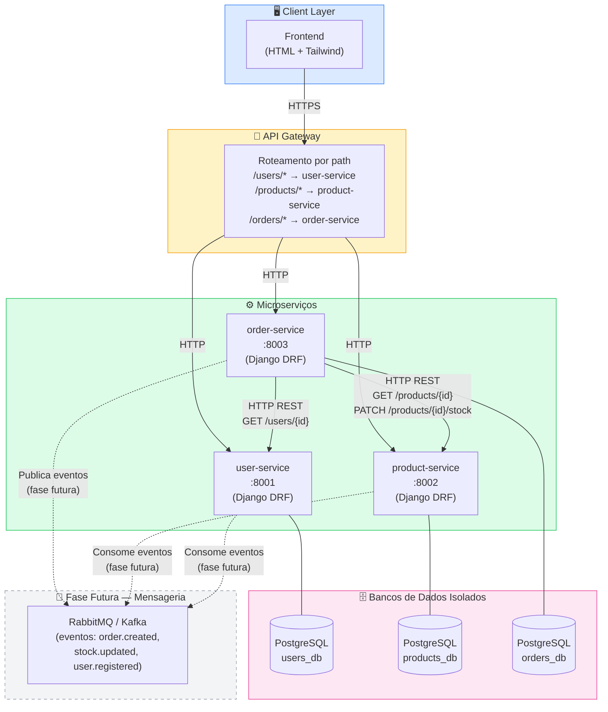

# Diagramas Arquiteturais — Marketplace Microserviços

---

## 1. Diagrama de Entidade-Relacionamento (ER)

> Cada entidade reside em um banco de dados isolado por serviço. As linhas tracejadas indicam referências lógicas por ID (sem FK física entre bancos).



---

## 2. Diagrama de Fluxo — Criação de Pedido

> Fluxo completo do usuário buscando produto até a confirmação do pedido.



---

## 3. Diagrama de Arquitetura — Visão Geral dos Serviços



---

## 4. Definição Completa das APIs

---

### user-service (porta 8001)

#### `POST /api/v1/auth/register`

Cadastra novo usuário.

**Request:**
```json
{
  "name": "João Silva",
  "email": "joao@example.com",
  "password": "SenhaSegura123!"
}
```

**Response 201:**
```json
{
  "id": "550e8400-e29b-41d4-a716-446655440000",
  "name": "João Silva",
  "email": "joao@example.com",
  "role": "customer",
  "is_active": true,
  "created_at": "2026-05-05T10:00:00Z"
}
```

**Response 400 (e-mail duplicado):**
```json
{
  "error": "EMAIL_ALREADY_EXISTS",
  "message": "Já existe uma conta com este e-mail."
}
```

---

#### `POST /api/v1/auth/login`

Autentica usuário e emite tokens JWT.

**Request:**
```json
{
  "email": "joao@example.com",
  "password": "SenhaSegura123!"
}
```

**Response 200:**
```json
{
  "access_token": "eyJhbGciOiJSUzI1NiIsInR5cCI6IkpXVCJ9...",
  "refresh_token": "dGhpcyBpcyBhIHJlZnJlc2ggdG9rZW4...",
  "token_type": "Bearer",
  "expires_in": 3600
}
```

**Response 401:**
```json
{
  "error": "INVALID_CREDENTIALS",
  "message": "E-mail ou senha incorretos."
}
```

---

#### `POST /api/v1/auth/refresh`

Renova o access token.

**Request:**
```json
{
  "refresh_token": "dGhpcyBpcyBhIHJlZnJlc2ggdG9rZW4..."
}
```

**Response 200:**
```json
{
  "access_token": "eyJhbGciOiJSUzI1NiIsInR5cCI6IkpXVCJ9...",
  "expires_in": 3600
}
```

---

#### `GET /api/v1/users/{id}`

Consulta interna — usada pelo order-service. Requer JWT válido.

**Headers:** `Authorization: Bearer <token>`

**Response 200:**
```json
{
  "id": "550e8400-e29b-41d4-a716-446655440000",
  "name": "João Silva",
  "email": "joao@example.com",
  "is_active": true
}
```

**Response 404:**
```json
{
  "error": "USER_NOT_FOUND",
  "message": "Usuário não encontrado."
}
```

---

#### `GET /api/v1/users/me`

Retorna dados do usuário autenticado.

**Headers:** `Authorization: Bearer <token>`

**Response 200:**
```json
{
  "id": "550e8400-e29b-41d4-a716-446655440000",
  "name": "João Silva",
  "email": "joao@example.com",
  "role": "customer",
  "is_active": true,
  "created_at": "2026-05-05T10:00:00Z"
}
```

---

### product-service (porta 8002)

#### `GET /api/v1/products`

Lista produtos ativos com filtros opcionais.

**Query Params:** `search`, `category`, `min_price`, `max_price`, `page`, `page_size`

**Response 200:**
```json
{
  "count": 42,
  "next": "/api/v1/products?page=2",
  "previous": null,
  "results": [
    {
      "id": "7b3f2a1c-d4e5-4f6a-b7c8-9d0e1f2a3b4c",
      "name": "Tênis Running Pro",
      "description": "Tênis leve para corridas longas",
      "price": "299.90",
      "stock_quantity": 50,
      "sku": "TNS-RUN-001",
      "category": "calçados",
      "is_active": true
    }
  ]
}
```

---

#### `GET /api/v1/products/{id}`

Retorna produto específico.

**Response 200:**
```json
{
  "id": "7b3f2a1c-d4e5-4f6a-b7c8-9d0e1f2a3b4c",
  "name": "Tênis Running Pro",
  "description": "Tênis leve para corridas longas",
  "price": "299.90",
  "stock_quantity": 50,
  "sku": "TNS-RUN-001",
  "category": "calçados",
  "is_active": true,
  "created_at": "2026-04-01T00:00:00Z",
  "updated_at": "2026-05-01T12:00:00Z"
}
```

**Response 404:**
```json
{
  "error": "PRODUCT_NOT_FOUND",
  "message": "Produto não encontrado."
}
```

---

#### `POST /api/v1/products`

Cria novo produto. Requer role `admin`.

**Headers:** `Authorization: Bearer <admin_token>`

**Request:**
```json
{
  "name": "Tênis Running Pro",
  "description": "Tênis leve para corridas longas",
  "price": "299.90",
  "stock_quantity": 50,
  "sku": "TNS-RUN-001",
  "category": "calçados"
}
```

**Response 201:**
```json
{
  "id": "7b3f2a1c-d4e5-4f6a-b7c8-9d0e1f2a3b4c",
  "name": "Tênis Running Pro",
  "sku": "TNS-RUN-001",
  "price": "299.90",
  "stock_quantity": 50,
  "is_active": true,
  "created_at": "2026-05-05T10:00:00Z"
}
```

---

#### `PATCH /api/v1/products/{id}/stock`

Atualiza estoque — chamada interna do order-service.

**Headers:** `Authorization: Bearer <token>` + `X-Internal-Service: order-service`

**Request:**
```json
{
  "quantity": -2
}
```

**Response 200:**
```json
{
  "id": "7b3f2a1c-d4e5-4f6a-b7c8-9d0e1f2a3b4c",
  "stock_quantity": 48
}
```

**Response 422 (estoque insuficiente):**
```json
{
  "error": "INSUFFICIENT_STOCK",
  "message": "Estoque insuficiente. Disponível: 1, solicitado: 2."
}
```

---

### order-service (porta 8003)

#### `POST /api/v1/orders`

Cria novo pedido. Fluxo orquestrado internamente.

**Headers:** `Authorization: Bearer <token>`

**Request:**
```json
{
  "shipping_address": "Rua das Flores, 123 — São Paulo/SP, CEP 01310-100",
  "items": [
    {
      "product_id": "7b3f2a1c-d4e5-4f6a-b7c8-9d0e1f2a3b4c",
      "quantity": 2
    },
    {
      "product_id": "a1b2c3d4-e5f6-7890-abcd-ef1234567890",
      "quantity": 1
    }
  ]
}
```

**Response 201:**
```json
{
  "id": "f1e2d3c4-b5a6-7890-1234-567890abcdef",
  "user_id": "550e8400-e29b-41d4-a716-446655440000",
  "status": "confirmed",
  "shipping_address": "Rua das Flores, 123 — São Paulo/SP, CEP 01310-100",
  "total_amount": "749.70",
  "items": [
    {
      "id": "item-uuid-1",
      "product_id": "7b3f2a1c-d4e5-4f6a-b7c8-9d0e1f2a3b4c",
      "product_name": "Tênis Running Pro",
      "unit_price": "299.90",
      "quantity": 2,
      "subtotal": "599.80"
    },
    {
      "id": "item-uuid-2",
      "product_id": "a1b2c3d4-e5f6-7890-abcd-ef1234567890",
      "product_name": "Meia Esportiva",
      "unit_price": "149.90",
      "quantity": 1,
      "subtotal": "149.90"
    }
  ],
  "created_at": "2026-05-05T10:05:00Z"
}
```

**Response 422:**
```json
{
  "error": "INSUFFICIENT_STOCK",
  "message": "Estoque insuficiente para: Tênis Running Pro. Disponível: 1, solicitado: 2."
}
```

**Response 503 (serviço indisponível):**
```json
{
  "error": "SERVICE_UNAVAILABLE",
  "message": "Não foi possível validar o produto no momento. Tente novamente."
}
```

---

#### `GET /api/v1/orders`

Lista pedidos do usuário autenticado.

**Headers:** `Authorization: Bearer <token>`

**Query Params:** `status`, `page`, `page_size`

**Response 200:**
```json
{
  "count": 3,
  "next": null,
  "previous": null,
  "results": [
    {
      "id": "f1e2d3c4-b5a6-7890-1234-567890abcdef",
      "status": "confirmed",
      "total_amount": "749.70",
      "items_count": 2,
      "created_at": "2026-05-05T10:05:00Z"
    }
  ]
}
```

---

#### `GET /api/v1/orders/{id}`

Detalha pedido específico.

**Headers:** `Authorization: Bearer <token>`

**Response 200:** (mesmo schema do POST 201)

**Response 403:**
```json
{
  "error": "FORBIDDEN",
  "message": "Você não tem permissão para acessar este pedido."
}
```

---

#### `PATCH /api/v1/orders/{id}/cancel`

Cancela pedido (somente status `pending` ou `confirmed`).

**Headers:** `Authorization: Bearer <token>`

**Response 200:**
```json
{
  "id": "f1e2d3c4-b5a6-7890-1234-567890abcdef",
  "status": "cancelled",
  "updated_at": "2026-05-05T10:10:00Z"
}
```

**Response 422:**
```json
{
  "error": "INVALID_STATUS_TRANSITION",
  "message": "Pedido com status 'shipped' não pode ser cancelado."
}
```

---

## 5. Estrutura de Repositório

```
desafio_marketplace/
│
├── services/
│   ├── user-service/
│   │   ├── .env.example
│   │   ├── Dockerfile
│   │   ├── requirements.txt
│   │   └── src/
│   │       ├── manage.py
│   │       ├── config/               ← settings, urls, wsgi
│   │       ├── apps/
│   │       │   ├── users/            ← models, serializers, views, urls
│   │       │   └── authentication/   ← JWT logic, tokens
│   │       └── tests/
│   │
│   ├── product-service/
│   │   ├── .env.example
│   │   ├── Dockerfile
│   │   ├── requirements.txt
│   │   └── src/
│   │       ├── manage.py
│   │       ├── config/
│   │       ├── apps/
│   │       │   └── products/         ← models, serializers, views, urls
│   │       └── tests/
│   │
│   └── order-service/
│       ├── .env.example
│       ├── Dockerfile
│       ├── requirements.txt
│       └── src/
│           ├── manage.py
│           ├── config/
│           ├── apps/
│           │   └── orders/           ← models, serializers, views, urls
│           ├── clients/              ← http clients para user-service e product-service
│           └── tests/
│
├── docs/
│   ├── ADR.md
│   └── DIAGRAMAS.md
│
├── frontend/
│   └── index.html
│
├── docker-compose.yml                ← orquestra os 3 serviços + bancos
└── README.md
```

---

## 6. Cabeçalhos HTTP Padrão

Todos os serviços devem implementar e respeitar os seguintes headers:

| Header | Direção | Propósito |
|---|---|---|
| `Authorization: Bearer <token>` | Client → Service | Autenticação JWT |
| `X-Correlation-ID: <uuid>` | Todos | Rastreabilidade distribuída |
| `X-Internal-Service: <nome>` | Service → Service | Identificação de chamadas internas |
| `Content-Type: application/json` | Todos | Contrato de payload |
| `Accept: application/json` | Client → Service | Negociação de conteúdo |

---

## 7. Códigos de Status HTTP Utilizados

| Código | Uso |
|---|---|
| 200 | Sucesso em GET / PATCH |
| 201 | Recurso criado (POST) |
| 400 | Payload malformado ou validação de campo |
| 401 | Token ausente ou inválido |
| 403 | Autenticado mas sem permissão |
| 404 | Recurso não encontrado |
| 422 | Regra de negócio violada (ex: estoque) |
| 503 | Dependência externa indisponível |
